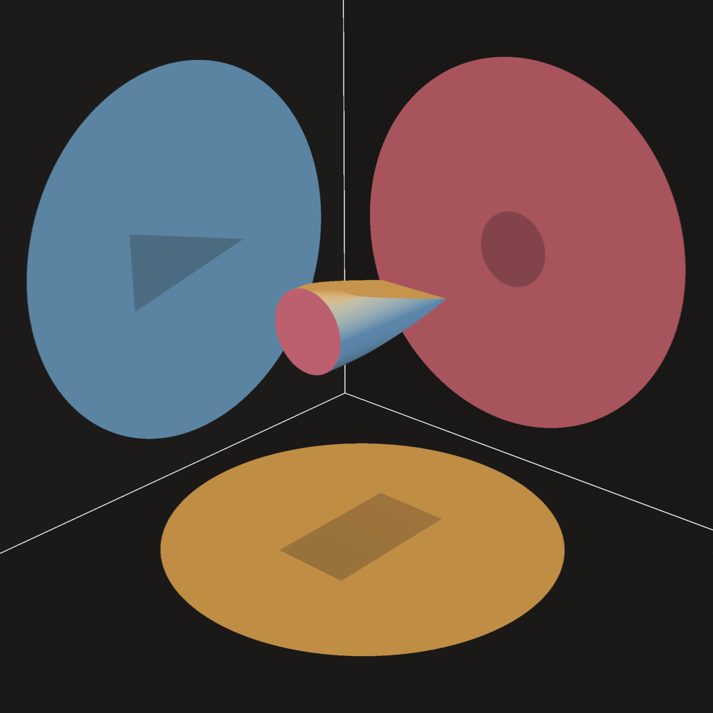

# TriformFacet

<p align="center">
  
</p>

A small Python/PyVista renderer that reproduces a remembered scene: the corner
of a room — a floor and two walls, doubling as an unscaled 3D coordinate
frame — with an object floating in the air above the floor, lit by three
lights, one per surface.

This is the seed image for what this project is actually about; it started as
an icon-design detour but the real subject turned out to be this scene.

## Concept

> "The truth one observes does not falsify the truth of others."

The floating object casts a **different, equally true shadow shape on each
surface**: a rectangle on the floor, a circle on one wall, a triangle on the
other. Each light sees the object from its own angle and reports back a
different but entirely accurate "truth" about its shape. No single shadow is
wrong — the object genuinely is all three at once, depending on where you
stand to look at it.

## Naming

Two names were weighed for this project before settling on **TriformFacet**.

*Triform* (Latin *tri-* + *forma*, "having three forms") is also an old
epithet for Hecate/Diana Triformis, the triple goddess of three-way
crossroads and thresholds — a fitting, unforced echo, since the scene's
whole set piece is a threshold where three surfaces meet at one corner.
*Facet* is a cut gem's flat face, and, figuratively, an aspect of something.
Together: the one facet that is triform — one object, one facet, three true
forms.

**Aletheia** (Greek ἀλήθεια, "un-concealment") was the other serious
candidate, and stays worth naming here even unused. Heidegger revived the
word for truth as an *event of disclosure* rather than mere correctness —
and crucially, every disclosure simultaneously conceals something else. That
is close to a literal description of this scene: stand where the amber light
shows the rectangle, and the circle and triangle are not false, just
concealed by the very act of that one truth showing itself to you. Aletheia
names *why* the other two shadows aren't visible at once; TriformFacet names
*what* there is to see. Aletheia lost out only on approachability — it
needs a philosophy gloss to land, where TriformFacet mostly explains itself.

## Current scene

- **Room**: a floor (`x`–`y` plane, `ROOM` × `ROOM`) and two walls (`x`–`z`
  and `y`–`z` planes, `ROOM` wide × `HEIGHT` tall) meeting exactly at the
  corner `(0, 0, 0)`. `ROOM = 28`, `HEIGHT = 24` — doubled twice now from
  their original values (ADR 0017, then again ADR 0021), so each surface's
  *area* is sixteen times its original size. Every doubling enlarges only
  the surfaces themselves (object size/position and light padding are
  fixed constants, untouched — ADR 0018/0021) with the camera rescaled to
  match (ADR 0020/0021). No scale/units are implied — it currently reads a
  bit like a coordinate-system diagram, which is expected for now; the
  intent going forward is to make it read more like an actual room and less
  like a coordinate system.
- **Floating object**: a "wedge cylinder" (see below) floating above the
  floor without touching any surface, long axis parallel to the floor/wall-1
  edge (the `x`-axis), colored a near-white light gray so it visibly reflects
  each surface's light color rather than showing its own hue.
  `CYL_CENTER = (M, M, M)` — the *same* distance `M = 3` from all three near
  surfaces (floor, wall_back, wall_side), not just matching *margins*
  arrived at via different coordinates (ADR 0012's approach, superseded by
  ADR 0017). `M` is a fixed constant, deliberately **not** derived from
  `ROOM`/`HEIGHT` (ADR 0018 — an earlier version used `M = HEIGHT/2`, which
  scaled the object and its light circles up right along with the room,
  the opposite of the intent). `CYL_RADIUS`/`CYL_LENGTH` (the object's own
  physical size) are likewise **not** scaled up with the room — kept at
  their original absolute size on purpose, so both the object and its
  light circles read relatively smaller within the now-bigger room, which
  is what closed the icon's leftover background-bleed gap (see Icon
  below).
- **Camera**: positioned inside the room, looking into the corner at a
  roughly 45°/45° oblique angle.
- **Lighting**: three positional spotlights, one per flat surface (floor,
  back wall, side wall), each with real shadow mapping enabled and each a
  distinct, clearly saturated color (amber / blue / rose) so it's visually
  obvious which light is responsible for which surface's shadow. Each light
  is placed on the axis that runs straight through the object's center and
  perpendicular to its target surface — sharing two of `CYL_CENTER`'s three
  coordinates exactly, varying only the one normal to that surface — then
  pulled back along that axis so the rays reaching the room are nearly
  parallel (direct, "sunlight"-like) rather than a nearby point source
  spraying outward at an oblique angle. See Known issues for why that
  distance is 5x the room size, not the originally-intended 10x. Each
  light's `cone_angle` is computed by `fit_cone_half_angle()` from the room's
  own dimensions, sized so its circular footprint stays inscribed within its
  own surface (tangent to the nearest edge) minus `LIGHT_PADDING` (`0.5`
  units) — the light stops short of that edge by a visible gap rather than
  running exactly tangent to it, so the circle doesn't touch the corner
  line described next (ADR 0017). It also still never spills past that
  surface's boundary onto a neighbor; a farther corner can go dark instead,
  which is the explicitly preferred tradeoff.
- **Corner edges**: the room's three shared edges (floor/wall_back,
  floor/wall_side, wall_back/wall_side) are drawn as bright, unlit lines
  (`add_edge_highlight_lines()`) on top of the lighting above — a deliberate
  cheat (see that function's docstring for why), added because the dark
  corners otherwise made the room read as "three shapes floating in a void"
  more than an actual 3D space. Originally a separate experiment, promoted
  to the default scene (ADR 0015).

## The wedge cylinder

To get a rectangle (floor), a circle (one wall), *and* a triangle (the other
wall) out of one solid object:

- Start from a plain cylinder, axis along `x`.
- Keep one end (the one facing the camera) as a full, untouched circular
  cross-section.
- Slice the rest with two symmetric planar cuts — one descending from the
  top, one rising from the bottom — that converge exactly on the object's
  centerline at the far end, leaving nothing there but a thin diametral line.

Why this preserves exactly the three shapes wanted:

| View direction | What it sees | Why |
| --- | --- | --- |
| Down the axis (end-on, → circle) | A full circle | The untouched full-circle end is a superset of every other cross-section along the length, so the silhouette is that circle regardless of the taper. |
| From above (→ floor, rectangle) | A rectangle | The two cuts only trim `z` (top/bottom); at every point along the taper the shape still reaches its full `y` = ±radius at `z = 0`, so the footprint's width never narrows. |
| From the side (→ other wall, triangle) | A triangle | The cuts taper the `z`-extent linearly from full radius at the circle end to zero at the far end — a linear taper is exactly a triangle in profile. |

Implemented as `make_wedge_cylinder()` in `render_scene.py`: build the plain
cylinder, then apply two `clip_closed_surface()` cuts (from
`pyvista`/`vtkClipClosedSurface`, which cuts *and* caps the result so it
stays a closed solid).

## Long-term goal

Three cleanly separated shadow shapes, one per surface (2 walls + floor),
each shape distinctly the product of that surface's light source being
(partially) blocked by the floating object. This now works — floor gives a
rectangle, one wall a circle, the other a triangle, each with a reasonably
well-defined edge (see Known issues for remaining roughness). Eventually the
floating object's construction should generalize beyond this one
circle/rectangle/triangle case.

## Running it

```bash
python3 -m venv .venv
.venv/bin/pip install pyvista
.venv/bin/python src/render_scene.py               # writes renders/scene.png — full illustration
.venv/bin/python src/render_icon.py                # writes renders/regular_icon.png — square icon crop
.venv/bin/python src/render_icon_highres.py        # writes renders/highres_icon.png — same icon, 8192px
.venv/bin/python src/render_icon_grayscale.py      # writes renders/regular_grayscale_icon.png — icon, light-only grayscale
.venv/bin/python src/render_icon_highres_grayscale.py  # writes renders/highres_grayscale_icon.png — same, 8192px
.venv/bin/python src/render_scene_blueprint.py      # writes renders/scene_blueprint.png — blueprint style variant
.venv/bin/python src/render_scene_celshade.py       # writes renders/scene_celshade.png — cel/toon style variant
.venv/bin/python src/render_scene_handdrawn.py      # writes renders/scene_handdrawn.png — hand-drawn style variant
.venv/bin/python src/render_icon_blueprint.py       # writes renders/regular_blueprint_icon.png — blueprint icon crop
.venv/bin/python src/render_icon_highres_blueprint.py  # writes renders/highres_blueprint_icon.png — same, 8192px
.venv/bin/python src/render_icon_celshade.py        # writes renders/regular_celshade_icon.png — cel/toon icon crop
.venv/bin/python src/render_icon_highres_celshade.py   # writes renders/highres_celshade_icon.png — same, 8192px
.venv/bin/python src/render_icon_handdrawn.py       # writes renders/regular_handdrawn_icon.png — hand-drawn icon crop
.venv/bin/python src/render_icon_highres_handdrawn.py  # writes renders/highres_handdrawn_icon.png — same, 8192px
```

Every script resolves `renders/` relative to its own file location (not the
cwd it's run from), so they can be invoked from anywhere and always land in
`<repo root>/renders/` (ADR 0028). Rendering is fully headless/off-screen
(VTK's software path) — no display or Xvfb needed on this machine.

## Repo layout

- `src/` — all `render_*.py` scripts. Flat, no package/`__init__.py` (ADR
  0003's single-static-illustration scope doesn't need one); they import
  each other directly by module name, which works because they're always
  invoked as `python src/<file>.py` (Python puts the script's own directory
  on `sys.path[0]`).
- `renders/` — every generated PNG. Named `<regular|highres>_[<style>_]icon.png`
  for icon crops (style omitted for the default look — ADR 0032) and
  `scene[_<style>].png` for wide establishing shots: `scene.png`,
  `regular_icon.png`, `highres_icon.png`, `regular_grayscale_icon.png`,
  `highres_grayscale_icon.png`, `scene_blueprint.png`,
  `regular_blueprint_icon.png`, `highres_blueprint_icon.png`,
  `scene_celshade.png`, `regular_celshade_icon.png`,
  `highres_celshade_icon.png`, `scene_handdrawn.png`,
  `regular_handdrawn_icon.png`, `highres_handdrawn_icon.png`. Nothing here
  is hand-edited; delete and re-run the scripts above to regenerate.
- `docs/adr/` — the ADR log (see below).
- `web/` — the three.js interactive viewer (see "Live viewer" below), a
  separate Node/Vite toolchain unrelated to the Python layout above.

## Icon

`render_icon.py` renders the same scene (via `render_scene.py`'s
`build_scene()`, shared so all variants stay in sync) through a square
window, sized to fully contain all three colored shadow circles rather than
crop them at the frame edge — see ADR 0014. ADR 0014 left one gap open: a
small background sliver in one or two frame corners. ADR 0017/0018 believed
this was closed by the first room doubling, but that was eyeballed on a
thumbnail, not pixel-checked — ADR 0022 measured directly and found a tiny
sliver was still there at every room size tried. Fixed in ADR 0022 by
giving the icon its **own camera**, independent of `render_scene.py`'s
(which stays tuned for the wide `scene.png` establishing shot): a closer
stop along the same viewing line, picked empirically (render + pixel-scan
the whole frame for background color, not glance at the corners) to be the
closest point with zero background pixels anywhere in the image. As a
bonus, this also restored the shadow circles to roughly their original
(pre-any-room-doubling) on-screen size, addressing separate "circles read
too small" feedback for the icon specifically. ADR 0023 then pulled the
camera in further still, searching down to the exact point circles start
clipping the frame edge and backing off to a safe margin short of it —
maximizing fill while keeping every circle fully contained and bleed still
at zero. ADR 0024 found that fill was uneven (off-center, not just an
aspect-ratio effect) and fixed it with a calculated camera-rig pan
(left=right, top=bottom now match to the pixel), re-maximizing fill
afterward — a small residual between the left/right pair and the top/
bottom pair remains, an explained floor from the shape cluster's own
non-square bounding box, not something a further camera move can close.
Reads clearly from roughly
128px down to maybe 64px; below that (true favicon sizes, 32px/16px) the
composition currently collapses into indistinct color blobs — an inherent
detail-density problem, not a framing one. A true 16px mark would need a
separately-designed, much-simplified graphic rather than a downscale of
this render.

`render_icon_highres.py` renders the identical composition (same camera,
via the shared `render_icon()` function) at 8192x8192 — `highres_icon.png`
— for large-format/print use. 8192 is a measured ceiling on this machine's
headless software-GL backend, not a round-number pick: 16384 fails outright
(`FRAMEBUFFER_INCOMPLETE_ATTACHMENT`). A vector `icon.svg` was tried and
rejected (ADR 0025) — `pyvista`'s SVG export embeds a raster screenshot
either way (verified byte-identical output with and without the "true
vector" flag); this scene's shadow-mapped shading has no vector
representation to export in the first place.

`render_icon_grayscale.py` / `render_icon_highres_grayscale.py` render the
same composition and camera again, but with the three spotlights swapped
from amber/blue/rose to light, fully desaturated grays (`#ffffff` /
`#d9d9d9` / `#b3b3b3`) — the three shadow shapes are told apart by
lightness instead of hue. Enabled by parameterizing `add_fitted_lights()`'s
light colors (ADR 0027) rather than forking the scene, so this look can
never drift out of sync with the colored one on geometry/camera/lighting
rig. Writes `regular_grayscale_icon.png` / `highres_grayscale_icon.png`.

## Style variants

Alternate rendering styles, built as independent scripts sharing the same
geometry/camera/shadow-mapping pipeline (ADR 0013's pattern of separate,
comparable variants rather than one direction picked unprompted). Each has
the full wide-shot + regular-icon + highres-icon set the default look has
(ADR 0032), written to its own `renders/*_<style>*.png` files without
touching the default look.

- **Blueprint/technical-drawing** (`render_scene_blueprint.py` /
  `render_icon_blueprint.py` / `render_icon_highres_blueprint.py`) — white
  linework on a flat mid-blue room, one uniform light color instead of
  three (the shadow shapes are told apart by shape/position alone, not hue
  or lightness), plus `add_feature_edges()` outlining the wedge cylinder's
  rim and taper creases. See ADR 0029. Writes `scene_blueprint.png` /
  `regular_blueprint_icon.png` / `highres_blueprint_icon.png`.
- **Cel/toon** (`render_scene_celshade.py` / `render_icon_celshade.py` /
  `render_icon_highres_celshade.py`) — default palette/lights, but the
  wedge cylinder gets flat (non-smooth) shading at a much lower polygon
  count so it reads as visibly faceted instead of smoothly gradient-shaded,
  outlined in bold black ink via `add_feature_edges()`. No literal
  quantized-band toon shader (VTK/PyVista expose none on this machine's
  headless backend) — an approximation using tools already in the
  pipeline. See ADR 0030. Writes `scene_celshade.png` /
  `regular_celshade_icon.png` / `highres_celshade_icon.png`.
- **Hand-drawn/sketchbook** (`render_scene_handdrawn.py` /
  `render_icon_handdrawn.py` / `render_icon_highres_handdrawn.py`) — warm
  sepia-on-parchment palette, and genuinely wobbly stroke geometry (not an
  image-space filter) for the room's three corner edges — each edge
  subdivided into points displaced by a smooth seeded sine-sum, drawn as
  2-3 independently-wobbled passes. The wedge cylinder keeps its clean
  `add_feature_edges()` outline (see ADR 0031's Consequences for why the
  wobble wasn't extended to it too). See ADR 0031, including a genuine bug
  (a translucent line lost the depth test against the opaque room quads it
  sat on and silently failed to render) diagnosed along the way. Writes
  `scene_handdrawn.png` / `regular_handdrawn_icon.png` /
  `highres_handdrawn_icon.png`.

Every style's icon crop reuses `render_icon.py`'s tuned camera
(`ICON_CAMERA_*`, ADR 0022/0023/0024) unchanged via
`render_icon_from_builder()` — the room/object geometry, which is what
that camera was actually fit to, is identical across every style variant
(ADR 0032). Verified, not assumed: each was pixel-scanned for its own
background color and found zero matching pixels, same containment
guarantee as the default icon.

## Live viewer

**[dbraun1991.github.io/TriformFacet](https://dbraun1991.github.io/TriformFacet/)**
— a three.js re-derivation of the scene, deployed via GitHub Pages, for
interactive in-browser viewing. Orbit the camera (drag to rotate, scroll to
zoom/pan) and switch between four live styles — default, blueprint,
cel-shade, grayscale — with no page reload.

This is a genuine re-derivation, not a code port: three.js is not a
PyVista/VTK target, so the room/object geometry, the fitted-cone spotlight
rig, and the shadow mapping were all rebuilt from scratch to match the
existing renders rather than translated line-by-line. See ADR 0033/0034 for
how, including the wedge cylinder's chord-cut cross-section derivation
(built as a hand-authored `BufferGeometry`, not a CSG library).

Source lives in `web/` (`cd web && npm install && npm run dev` for local
development) — a separate Node/Vite toolchain, untouched by and unrelated
to `src/`/`renders/` above. The Python pipeline remains the source of truth
for every static render; the viewer is purely additive.

### Differences from the Python renderer

Deliberate simplifications, not defects:

- **Shadow fidelity/AA** differs from VTK's fixed software-rasterized SSAA
  baseline — browser WebGL anti-aliasing quality varies by GPU/driver. The
  three.js shadow maps are tuned to 2048px (real-time, `PCFShadowMap`),
  which in practice reads sharper than the Python side's own documented
  "somewhat pixelated/jagged" shadow-edge limitation (see Known issues
  above), since VTK doesn't expose a way to raise that resolution.
- **Hand-drawn/sketchbook style is not ported** — see AGENTS.md → Features
  & Future Work.
- **Orbit + style switcher only** — no parametric sliders (room/object/
  light controls) in this pass.
- **Scene is authored and rendered z-up** (`camera.up = (0,0,1)`), a
  deliberate deviation from three.js's y-up default, so every ported
  constant (`ROOM`, `CYL_CENTER`, `SCENE_CAMERA_POSITION`, etc.) stays
  copy-pasteable straight from `src/render_scene.py` rather than needing an
  axis remap.
- **Light-throw distance re-validated independently**: `FAR = 5 * ROOM`
  (the near-parallel spotlight pull-back) matches render_scene.py's own
  ratio, but VTK's 5x-vs-10x shadow-coverage cliff (see Known issues above)
  is a VTK-specific artifact — three.js's shadow mapper was tuned against
  this same distance from scratch, not assumed to share that limitation.

## Key parameters (`src/render_scene.py`)

| Name | Meaning |
| --- | --- |
| `ROOM` | Floor/wall extent along x and y |
| `HEIGHT` | Wall height along z |
| `CYL_RADIUS`, `CYL_LENGTH`, `CYL_CENTER` | Wedge cylinder's base size and position (before tapering) |
| `make_wedge_cylinder()` | Builds the tapered solid — see "The wedge cylinder" above |
| `lights` dict | Three `pv.Light` spotlights, one per surface, each pinned to two of `CYL_CENTER`'s coordinates, pulled back `FAR = 5 * ROOM` along the third, given its own color, and sized via `fit_cone_half_angle()` |
| `fit_cone_half_angle()` | Computes a light's `cone_angle` so its footprint stays inscribed within its target surface, minus `LIGHT_PADDING` — see "Lighting" above |
| `LIGHT_PADDING` | Gap kept between each light shape and its nearest white corner line (ADR 0017) |
| `build_room_and_object(plotter, palette=None, surface_shading=None, object_shading=None, cylinder_resolution=96)` | Adds just the room and object (no lighting) — shared by every render variant. `palette` overrides `DEFAULT_PALETTE`'s colors (ADR 0029); `surface_shading`/`object_shading` override `DEFAULT_SURFACE_SHADING`/`DEFAULT_OBJECT_SHADING`'s ambient/diffuse/etc. for the room quads/cylinder respectively; `cylinder_resolution` overrides its polygon count (ADR 0030, used by the cel/toon variant for a visibly faceted low-poly look). Returns the four meshes added |
| `add_fitted_lights(plotter)` | The inscribed-circle lighting + shadows — the scene's one lighting rig |
| `add_edge_highlight_lines(plotter)` | Unlit corner-edge lines — see "Current scene" → Corner edges above |
| `add_feature_edges(plotter, meshes, feature_angle=30.0)` | Unlit boundary/crease-edge wireframe over given meshes (ADR 0029) — the blueprint variant's linework. `feature_angle` lowers the dihedral-angle threshold for what counts as an edge (ADR 0030, needed for a low-poly mesh's shallower facet angles) |
| `build_scene(plotter, light_colors=None)` | `build_room_and_object` + `add_fitted_lights` + `add_edge_highlight_lines` — the scene, used by `render_scene.py` and `render_icon.py`. `light_colors` overrides `DEFAULT_LIGHT_COLORS` (ADR 0027, used by the grayscale icon variant) |

## Known issues

- **Shadow-map coverage breaks down at extreme light distances.** Pulling
  the lights back to 10x the room size (as first tried, for the most
  "direct"/parallel light) caused the illuminated area to shrink to a
  fraction of each wall — most of the floor and the outer edges of both
  walls went dark. Isolated testing showed this is **not** a spotlight
  `cone_angle` problem (widening it from 15° to 75° made no difference); it's
  a VTK shadow-map limitation at large light-to-scene distance ratios that
  this PyVista version doesn't expose controls for. 5x the room size stays
  inside the range where coverage is complete while keeping the light
  nearly as directional (angular spread only grows from ~4° to ~8°).
- **Shadow edges are somewhat pixelated/jagged**, especially the triangle's
  hypotenuse and the circle's boundary — a resolution limit of VTK's default
  shadow map, which this PyVista version doesn't expose a way to increase.
- ~~**Faint secondary shadows.**~~ Resolved. Fitting each light's
  `cone_angle` (above) removed cross-illumination *between the three scene
  lights*, but a second shadow was still visible afterward — traced to
  `pv.Plotter()`'s `lighting="light kit"` default, which silently attaches
  5 extra camera-relative lights (a headlight + 4 "camera lights") that
  `enable_shadows()` was casting shadows from too. Fixed by constructing
  the plotter with `lighting="none"`, leaving only the three intended
  lights (confirmed via `len(plotter.renderer.lights) == 3`).
- The scene is a single fixed illustration, not yet parameterized for
  generating variations (e.g. varying camera/viewing angle, object shape, or
  producing many scenes programmatically) — out of scope for now, since the
  immediate goal was one explainer image.
